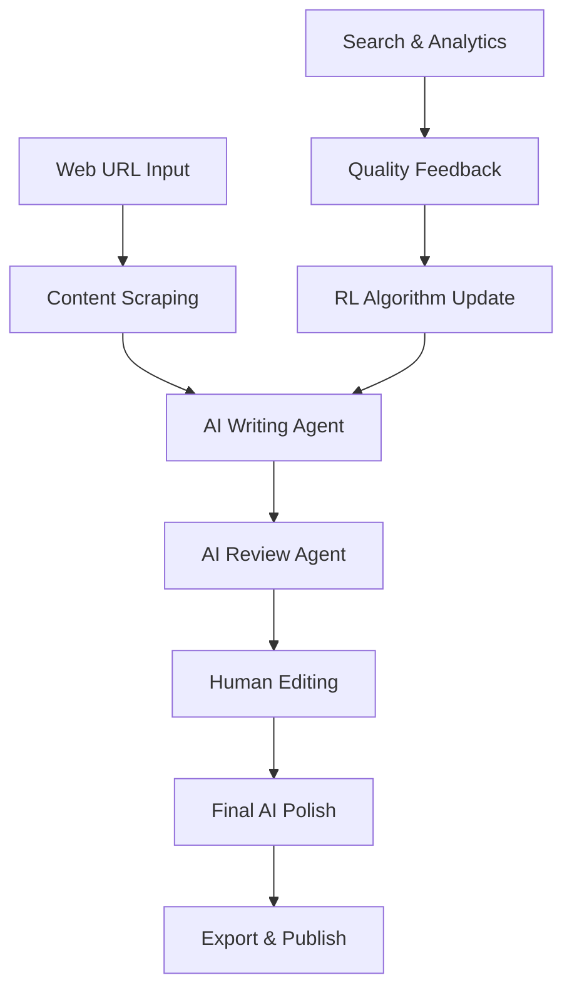

# 📚 Automated Book Publication Workflow

[](https://www.python.org/downloads/)
[](https://gradio.app/)
[](https://ai.google.dev/)

An advanced AI-driven content processing pipeline that automates the entire book publication workflow - from web scraping to publication-ready content. Built with Python, Gradio, and Google's Gemini AI.

## 🎥 Video Demonstration

[](https://your-video-link-here.com)

*Click the badge above to watch a complete walkthrough of the Book Publication Workflow in action!*


## 🎯 Features

### 🔄 **Complete Pipeline Automation**
- **Web Scraping**: Extract content from any web source with screenshot capture
- **AI Processing**: Multi-iteration content enhancement using Google Gemini
- **Human Editing**: Intuitive interface for manual review and editing
- **Final Processing**: AI-powered final polish for publication quality
- **Export System**: Multiple format support (TXT, MD, JSON)

### 🤖 **AI-Powered Intelligence**
- **Multi-Agent System**: Specialized AI agents (Writer, Reviewer, Editor)
- **Reinforcement Learning**: Smart content ranking and quality assessment
- **Quality Scoring**: Automated content quality metrics
- **Context Awareness**: Maintains context throughout the processing pipeline

### 🔍 **Advanced Search & Analytics**
- **Vector Database**: ChromaDB integration for semantic search
- **Version Control**: Complete content version tracking
- **Performance Monitoring**: Real-time workflow statistics
- **Quality Feedback**: Machine learning-based content improvement

### 🎨 **User Experience**
- **Intuitive Interface**: Clean, tab-based Gradio interface
- **Real-time Updates**: Live status tracking across all stages
- **Batch Processing**: Process multiple URLs simultaneously
- **Visual Feedback**: Screenshots and progress indicators

## 🚀 Quick Start

### Prerequisites
- Python 3.8 or higher
- Google Gemini API key
- Chrome/Chromium browser (for web scraping)

### Installation

1. **Clone the repository**
```bash
git clone https://github.com/sohan2311/automated-book-publication-workflow.git
cd automated-book-publication-workflow
```

2. **Install dependencies**
```bash
pip install -r requirements.txt
```

3. **Set up environment variables**
```bash
cp .env.template .env
# Edit .env and add your Gemini API key
GEMINI_API_KEY=your_gemini_api_key_here
```

4. **Initialize the database**
```bash
python init_db.py
```

5. **Run the application**
```bash
python main_file.py
```

6. **Access the interface**
Open your browser and navigate to `http://localhost:7860`

## 📖 Usage Guide

### 1. **Content Scraping**
- Enter any web URL in the scraping tab
- Click "Extract Content" to scrape text and take screenshots
- Review extracted content and send to AI processing

### 2. **AI Processing**
- Configure processing iterations (1-5)
- AI agents automatically enhance content for clarity and engagement
- Multiple review cycles ensure high-quality output

### 3. **Human Editing**
- Manual review and editing interface
- Add editor notes and comments
- Real-time content editing with version tracking

### 4. **Final Processing**
- AI-powered final polish
- Publication-ready formatting
- Export in multiple formats

### 5. **Search & Analytics**
- Search through all content versions
- Filter by processing status
- Provide quality feedback for continuous improvement

## 🏗️ Architecture

### Core Components

```
📦 Project Structure
├── 🌐 Web Scraping (Playwright)
├── 🤖 AI Processing (Google Gemini)
├── 🔍 Search Engine (ChromaDB)
├── 📊 Analytics (Custom RL Algorithm)
├── 🖥️ User Interface (Gradio)
└── 💾 Data Management (JSON + Vector DB)
```

### AI Agent System
- **Writer Agent**: Content enhancement and rewriting
- **Reviewer Agent**: Quality assessment and improvement suggestions
- **Editor Agent**: Final polish and formatting

### Technology Stack
- **Backend**: Python, AsyncIO
- **AI/ML**: Google Gemini API, ChromaDB, Sentence Transformers
- **Web Scraping**: Playwright, BeautifulSoup
- **Frontend**: Gradio
- **Database**: ChromaDB (Vector), JSON (Metadata)
- **Processing**: NumPy, scikit-learn

## 📊 Performance Metrics

The system tracks comprehensive performance metrics:
- **Processing Speed**: Average processing time per stage
- **Quality Scores**: Automated content quality assessment
- **Success Rates**: Operation success tracking
- **Version Analytics**: Content version evolution tracking

## 🔧 Configuration

### Environment Variables
```bash
GEMINI_API_KEY=your_api_key_here
CHROMA_DB_PATH=./data/chroma_db
SCREENSHOTS_PATH=./screenshots
EXPORTS_PATH=./exports
```

### Customization Options
- AI processing iterations
- Quality scoring algorithms
- Search result rankings
- Export format templates


## 📁 Project Structure

```
automated-book-publication-workflow/
├── .gradio/                    # Gradio cache files
├── content/                    # Processed content storage
├── data/                       # Database and persistent data
├── exports/                    # Exported final content
├── logs/                       # Application logs
├── models/                     # AI model cache
├── screenshots/                # Web scraping screenshots
├── .env                        # Environment variables
├── .env.template              # Environment template
├── .gitignore                 # Git ignore rules
├── config.yaml                # Configuration file
├── human_edit.txt             # Human editing templates
├── init_db.py                 # Database initialization
├── install_dependencies.py    # Dependency installer
├── main_file.py              # Main application file
├── requirements.txt           # Python dependencies
├── sample_workflow.py         # Usage examples
├── setup.py                   # Package setup
└── README.md                  # This file
```

## 🔄 Workflow Process



## 🤝 Contributing

We welcome contributions! Please follow these steps:

1. Fork the repository
2. Create a feature branch (`git checkout -b feature/amazing-feature`)
3. Commit your changes (`git commit -m 'Add amazing feature'`)
4. Push to the branch (`git push origin feature/amazing-feature`)
5. Open a Pull Request

### Development Setup
```bash
# Install development dependencies
pip install -r requirements-dev.txt

# Run tests
python -m pytest tests/

# Format code
black main_file.py

# Type checking
mypy main_file.py
```

## 📝 License

This project is licensed under the MIT License - see the [LICENSE](LICENSE) file for details.

## 🙏 Acknowledgments

- **Google Gemini AI** for powerful language processing
- **Gradio** for the amazing interface framework
- **ChromaDB** for vector database capabilities
- **Playwright** for reliable web scraping
- **Open Source Community** for the incredible tools and libraries

## 📞 Contact & Support

### 👨‍💻 Developer
**Sohan Maity**
- 🔗 LinkedIn: [Connect with me](https://www.linkedin.com/in/sohan-maity-26881a288/)
- 🐙 GitHub: [@sohan2311](https://github.com/sohan2311)


### 🐛 Issues & Feature Requests
- 🔍 [Browse Issues](https://github.com/sohan2311/automated-book-publication-workflow/issues)
- 💡 [Request Feature](https://github.com/sohan2311/automated-book-publication-workflow/issues/new)
- 🐛 [Report Bug](https://github.com/sohan2311/automated-book-publication-workflow/issues/new)

## 🌟 Show Your Support

If this project helped you, please consider:
- ⭐ Starring the repository
- 🐛 Reporting bugs or suggesting features
- 🤝 Contributing to the codebase
- 📢 Sharing with others who might benefit

---

<div align="center">

**Built using  Python, AI, and Open Source Technologies**

[](https://www.python.org/)
[](https://ai.google.dev/)


</div>
